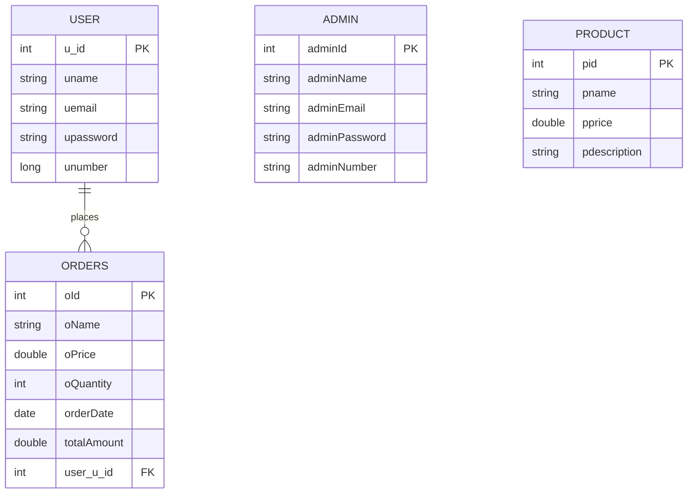

# Food Fiesta - Spring Boot Fullstack Project

**Food Fiesta** is a production-ready Spring Boot fullstack dining management application built using **Java 21**, **Spring Boot 3.4.2**, **Thymeleaf**, **Spring Security**, **Spring Data JPA**, and **MySQL**.

The project is fully deployed on Render and demonstrates modern backend development practices including authentication, role-based authorization, REST API integration, database management, and cloud deployment.

---

## 🚀 Live Deployment

🌐 **Live Application**  
https://food-fiesta-mlwh.onrender.com

💻 **GitHub Repository**  
https://github.com/prince12raj/food-app-

---

## 🛠️ Tech Stack

| Layer | Technology |
| :--- | :--- |
| Backend | Java 21, Spring Boot 3.4.2 |
| Security | Spring Security |
| ORM | Spring Data JPA / Hibernate |
| Frontend | Thymeleaf, HTML, CSS, JavaScript |
| Database | MySQL |
| API Documentation | Swagger / OpenAPI |
| Build Tool | Maven Wrapper |
| Deployment | Render |
| Containerization | Docker |

---

## ✨ Key Features

- Secure authentication and authorization system
- Role-based Admin and User access
- Product management system
- Order placement and order history
- Responsive Thymeleaf frontend
- REST API integration
- Swagger API documentation
- MySQL database integration
- Docker support for containerized deployment
- Cloud deployment on Render

---

## 📂 Project Structure

```text
src
 ┣ main
 ┃ ┣ java
 ┃ ┣ resources
 ┃ ┃ ┣ templates
 ┃ ┃ ┣ static
 ┃ ┃ ┗ application.properties
 ┃ ┗ test
 ┣ pom.xml
 ┗ Dockerfile
```

---

## 🗄️ Database Architecture



---

## ⚙️ Prerequisites

Before running the project locally, make sure you have:

- JDK 21
- MySQL Server
- Git
- Maven (optional because Maven Wrapper is included)

---

## 📥 Clone Repository

```bash
git clone https://github.com/prince12raj/food-app-.git
cd food-app-
```

---

## ▶️ Run Application

### Linux / Mac

```bash
./mvnw spring-boot:run
```

### Windows PowerShell

```powershell
.\mvnw.cmd spring-boot:run
```

---

## 🛢️ MySQL Configuration

Update the `application.properties` file:

```properties
spring.datasource.url=jdbc:mysql://localhost:3306/foodfiesta
spring.datasource.username=root
spring.datasource.password=YOUR_PASSWORD

spring.jpa.hibernate.ddl-auto=update
spring.jpa.show-sql=true
spring.jpa.properties.hibernate.dialect=org.hibernate.dialect.MySQLDialect
```

---

## 📑 API Documentation

Swagger UI:

```text
https://food-fiesta-mlwh.onrender.com/swagger-ui/index.html
```

---

## 🐳 Docker Deployment

### Build Docker Image

```bash
docker build -t food-fiesta .
```

### Run Docker Container

```bash
docker run -p 8080:8080 --name food-fiesta-app food-fiesta
```

### Run Using Docker Compose

```bash
docker compose up -d
```

---

## 📦 Build Project

```bash
./mvnw clean package
```

Windows:

```powershell
.\mvnw.cmd clean package
```

---

## ☁️ Deployment

The application is deployed on **Render** for cloud hosting and production access.

### Deployment Link

https://food-fiesta-mlwh.onrender.com

---

## 👨‍💻 Developer

### Prince Raj

- GitHub: https://github.com/prince12raj
- Project Repository: https://github.com/prince12raj/food-app-

---

## 📄 License

This project is licensed under the MIT License.
